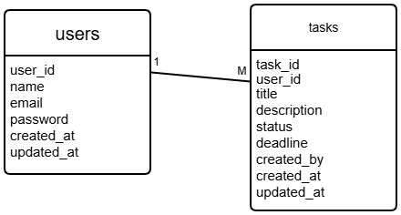
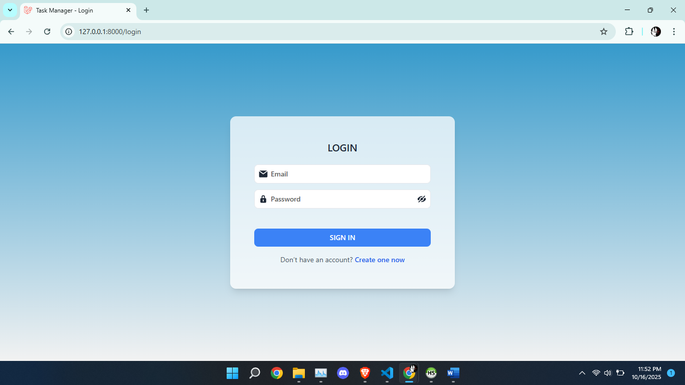
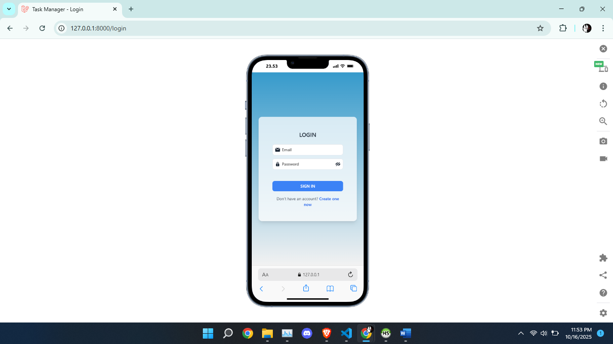
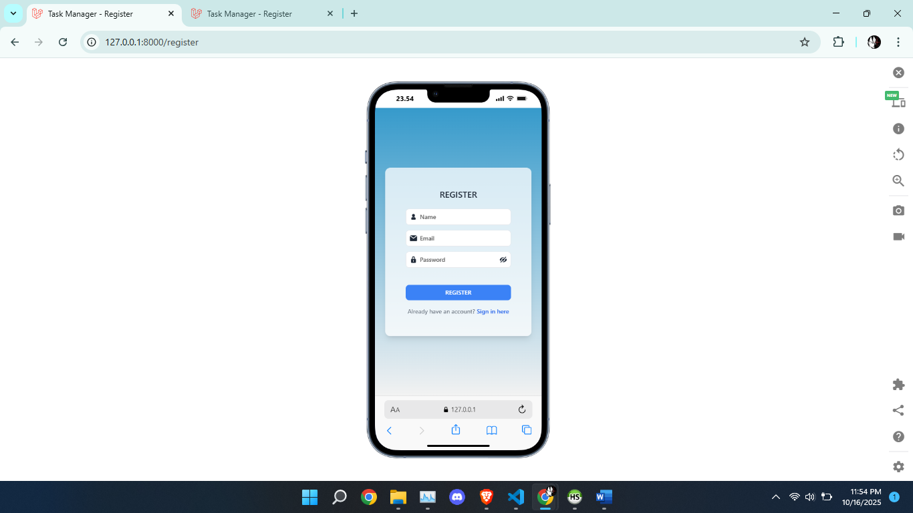
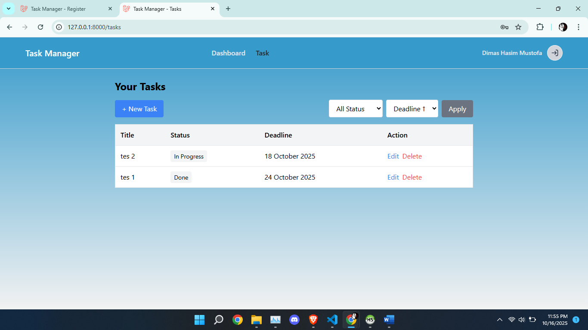
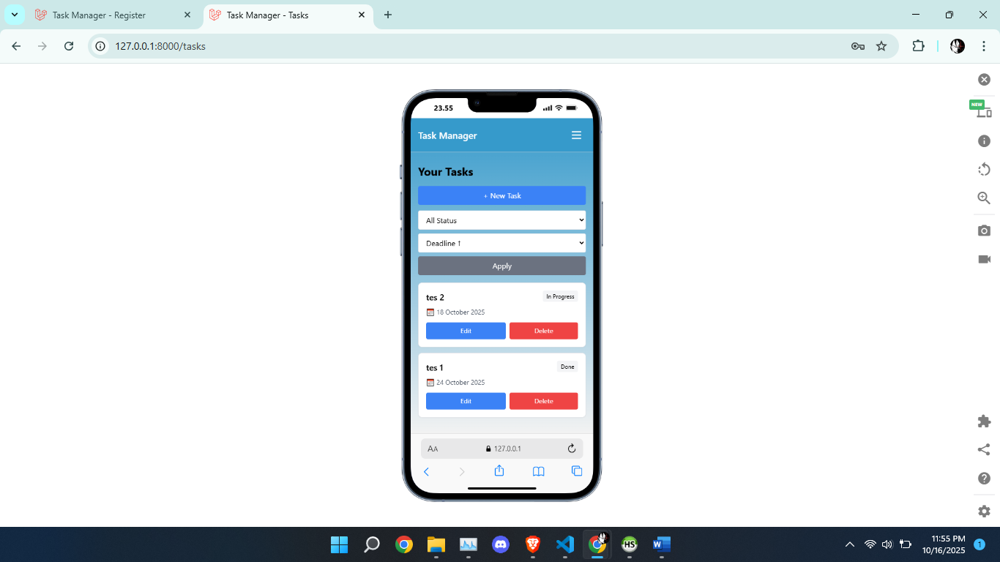

# Task Management Application

Aplikasi manajemen tugas sederhana yang memungkinkan pengguna untuk membuat, membaca, memperbarui, dan menghapus task dengan fitur filtering dan sorting berdasarkan status dan deadline.

## Fitur Utama

-   ✅ CRUD operations untuk task management
-   🔍 Filter task berdasarkan status (To Do, In Progress, Done)
-   📅 Sort task berdasarkan deadline
-   📱 Responsive design untuk mobile dan desktop
-   🎨 UI yang clean dan modern

## Teknologi yang Digunakan

### Backend

-   PHP 8.x
-   Laravel 11.x
-   MySQL

### Frontend

-   Blade Templates
-   Tailwind CSS
-   JavaScript

## Cara Menjalankan Aplikasi

### Prerequisites

-   PHP >= 8.1
-   Composer
-   MySQL
-   Node.js & NPM

### Langkah Instalasi

1. **Clone repository**

```bash
   git clone <repository-url>
   cd <project-folder>
```

2. **Install dependencies**

```bash
   composer install
   npm install
```

3. **Setup environment**

```bash
   cp .env.example .env
   php artisan key:generate
```

4. **Konfigurasi database**

    Buka file `.env` dan sesuaikan konfigurasi database:

```env
   DB_CONNECTION=mysql
   DB_HOST=127.0.0.1
   DB_PORT=3306
   DB_DATABASE=task_manager
   DB_USERNAME=root
   DB_PASSWORD=
```

5. **Jalankan migration dan seeder**

```bash
   php artisan migrate --seed
```

6. **Compile assets**

```bash
   npm run dev
```

7. **Jalankan aplikasi**

```bash
   php artisan serve
```

8. **Akses aplikasi**

    Buka browser dan akses: `http://localhost:8000`

## Informasi Login Dummy

```
Email: test@example.com
Password: password
```

## Screenshot

Struktur Database


Login Web


Login Mobile


Register Web


Register Mobile


Task Web


Task Mobile

